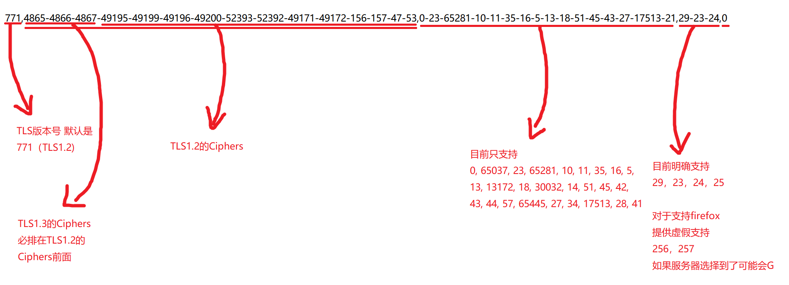

# node-libcurl

## Different with Nodejs fetch api
* The fingerprint can be customized to look like chrome or firefox ,it modified the BoringSSL extension, set the custom cipher suite with Libcurl
------------

## Attention by custom ja3 fingerprint!!!
* ssl support for node-libcurl is provided by boringssl
* boringssl does not provided the following support
* 1. extension support group only support [P-256, P-384, P-521, X25519], but the library was modified to provide dummy support groups, like [ffdhe2048, ffdhe3072] (ja3 is 256,257). if you use them, it may cause an SSL connection error. This depends on whether the server selects these two support groups
* 2. ec_point_format (ja3 is ...,0-1-2) only support 0 (uncompressed)
* 3. extensions only support (ja3)[0, 65037, 23, 65281, 10, 11, 35, 16, 5, 13, 13172, 18, 30032, 14, 51, 45, 42, 43, 44, 57, 65445, 27, 34, 17513, 28, 41]
------------




## Build Status

|      Platform       | Support |
| :-----------------: | :-----: |
|  __Windows (x64)__  | __Yes__ |
|  __Windows (x86)__  | __No__  |
|  __Windows (arm)__  | __No__  |
| __Ubuntu (x86_64)__ | __Yes__ |
| __MacOS (x86_64)__  | __Yes__ |
|  __MacOS (arm64)__  | __Yes__  |
------------

## How to Install
> npm i -g pnpm
> pnpm i @ossiana/node-libcurl
------------


## Use Sample

### import as ES Module
```javascript
import { LibCurl, fetch, requests } from '@ossiana/node-libcurl'
```

### import as CommonJS Module
```javascript
const { LibCurl, fetch, requests } = require('@ossiana/node-libcurl')
```

### browser fetch  style
```javascript
fetch("https://xxx.io/api/graphql/").then(e => e.json())
```
### requests  style (🔥)
```javascript
const session = requests.session();

session.setCookie('ua', '123=/1a', '.baidu.com', '/');

const res = await session.get('https://www.baidu.com', {
    headers: {
        "user-Agent": "1"
    }
});
console.log(res.headersMap);
console.log(session.getCookiesMap().get('ua'));
console.log(res.text);
```